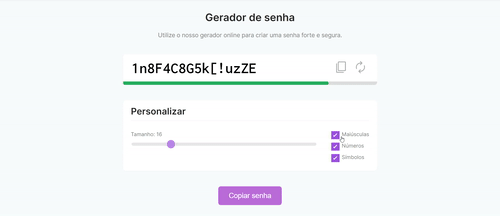

<h1>Gerador de senha</h1>

  &#160;&#160;
  &#160;&#160;
  &#160;&#160;
  

<h3>Descrição:</h3>

Exemplo de um gerador de senha online.

<h3>Funcionalidades:</h3>

Projeto de um gerador de senha usando opções de níveis de segurança.

<h3>Tecnologias utilizadas:</h3>

  
  

  
  
<h3>Conclusão:</h3>

Esse projeto possui uma funcionalidade para escolher o nível de segurança da senha com opções tipo checklist, para deixar mais segura.

